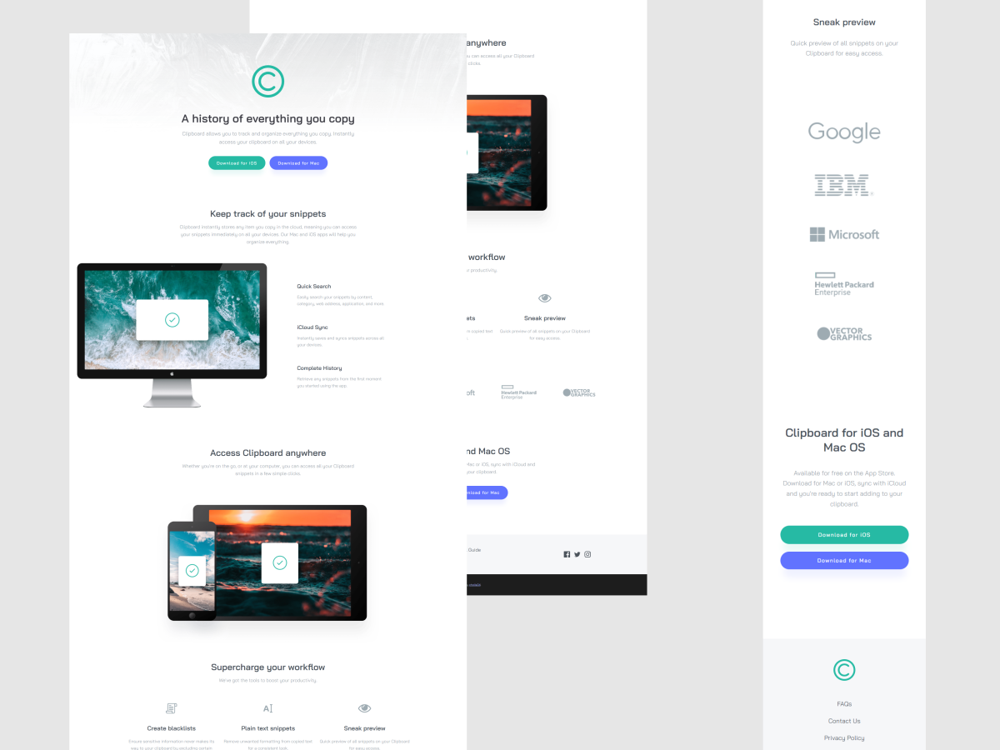
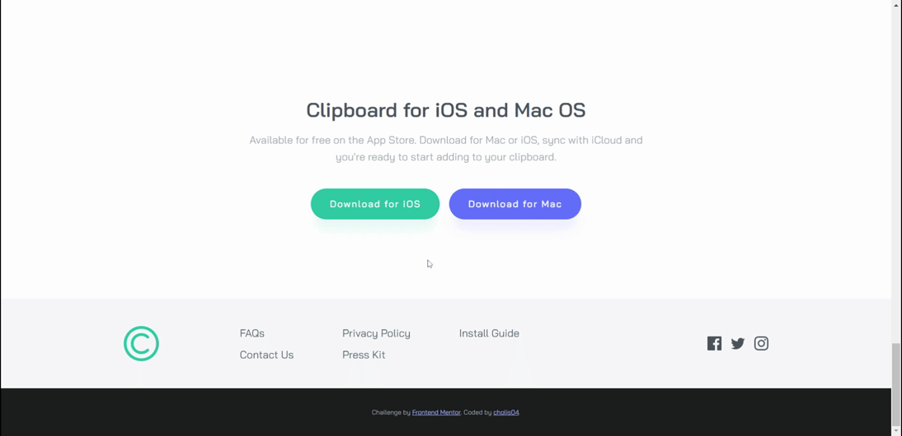
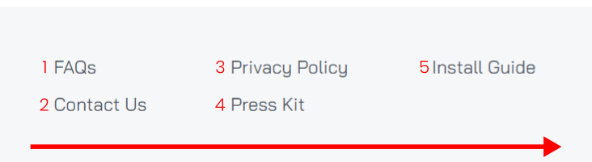
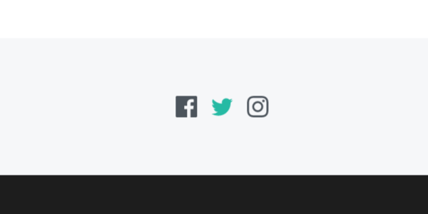

# Frontend Mentor - Clipboard landing page solution

This is a solution to the [Clipboard landing page challenge on Frontend Mentor](https://www.frontendmentor.io/challenges/clipboard-landing-page-5cc9bccd6c4c91111378ecb9). Frontend Mentor challenges help you improve your coding skills by building realistic projects.

## Table of contents

- [Overview](#overview)
  - [The challenge](#the-challenge)
  - [Screenshot](#screenshot)
  - [Links](#links)
- [My process](#my-process)
  - [Built with](#built-with)
  - [What I learned](#what-i-learned)
  - [Continued development](#continued-development)
- [Author](#author)

## Overview

### The challenge

Users should be able to:

- View the optimal layout for the site depending on their device's screen size
- See hover states for all interactive elements on the page

### Screenshot

#### Full Preview



#### Active State Preview



### Links

- Live Site URL: [https://cholis04.github.io/clipboard-landing-page-master/](https://cholis04.github.io/clipboard-landing-page-master/)

## My process

### Built with

- Semantic HTML5 markup
- CSS custom properties
- Mobile-first workflow
- Flexbox

### What I learned

#### Horizontal Wrapping Column

in this challenge, I implemented a wrapper flow in a column and it will shift sideways once the item height approaches the wrapper height limit. This can be done by adding the flex-direction property with a column value. Then set a fixed height. And also add flex-wrap property with wrap value.



Here's the code I use:

```css
footer div.footer > nav.page-link > ul {
  max-width: 560px;
  height: 60px;
  display: flex;
  flex-direction: column;
  flex-wrap: wrap;
  align-items: flex-start;
  justify-content: space-between;
}
```

#### Fill Property On CSS



Previously I used the img tag to display the svg. but it takes some additional properties to be able to change the color of the svg inside the img tag. Then I decided to use the SVG tag itself in the HTML. The problem started when we selected svg in css. and the color of the svg doesn't change at all.

```css
footer div.footer > nav.social-link > ul > li > a:hover > svg {
  fill: hsl(171, 66%, 44%);
}
```

Turns out there's something I missed. If we look at the SVG tag in the HTML code. Inside the SVG Tag itself still has a Path tag.

```html
<svg width="24" height="24" xmlns="http://www.w3.org/2000/svg">
  <path
    d="M12 2.163c3.204 0 3.584.012 4.85.07 3.252.148 4.771 1.691 4.919 4.919.058 1.265.069 1.645.069 4.849 0 3.205-.012 3.584-.069 4.849-.149 3.225-1.664 4.771-4.919 4.919-1.266.058-1.644.07-4.85.07-3.204 0-3.584-.012-4.849-.07-3.26-.149-4.771-1.699-4.919-4.92-.058-1.265-.07-1.644-.07-4.849 0-3.204.013-3.583.07-4.849.149-3.227 1.664-4.771 4.919-4.919 1.266-.057 1.645-.069 4.849-.069zM12 0C8.741 0 8.333.014 7.053.072 2.695.272.273 2.69.073 7.052.014 8.333 0 8.741 0 12c0 3.259.014 3.668.072 4.948.2 4.358 2.618 6.78 6.98 6.98C8.333 23.986 8.741 24 12 24c3.259 0 3.668-.014 4.948-.072 4.354-.2 6.782-2.618 6.979-6.98.059-1.28.073-1.689.073-4.948 0-3.259-.014-3.667-.072-4.947-.196-4.354-2.617-6.78-6.979-6.98C15.668.014 15.259 0 12 0zm0 5.838a6.162 6.162 0 100 12.324 6.162 6.162 0 000-12.324zM12 16a4 4 0 110-8 4 4 0 010 8zm6.406-11.845a1.44 1.44 0 100 2.881 1.44 1.44 0 000-2.881z"
    fill="#4C545C"
    fill-rule="nonzero"
  />
</svg>
```

And yes, I just need to select the path tag to change the color of the svg, by adding fill property in CSS

```css
footer div.footer > nav.social-link > ul > li > a:hover > svg > path {
  fill: hsl(171, 66%, 44%);
}
```

### Continued development

As in the case above. I gave justify-content: space between. this looks normal when there are only 2 lines on the menu. however if the height of the wrapper is increased and will be 3 rows, the last 2 menu items will be far apart from each other. If only there was a property in justify-item / justify-self, maybe the last two items could have different values ​​in the justify-content property like flex-start. Maybe in the future to make a case like this can be with other css properties, or even use JavaScript help.

## Author

- Website - [https://cholis04.github.io](https://cholis04.github.io)
- Frontend Mentor - [@cholis04](https://www.frontendmentor.io/profile/cholis04)
- Dribbble - [cholis04](https://dribbble.com/cholis04)
- Instagram - [@cholis04](https://instagram.com/cholis04)
- Codepen - [cholis04](https://codepen.io/cholis04)
